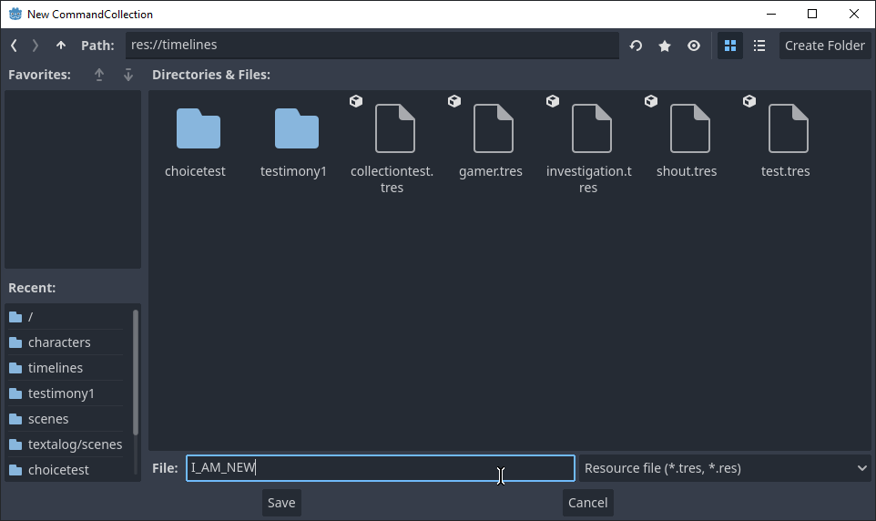

# Getting Started!

So you want to make a visual novel, huh? With NovelTest, it's easy! Here's a step-by-step guide to get you set up:

1. Make sure you have [Godot 4.2+](https://godotengine.org/download/windows/) installed
2. Grab the latest [release](https://github.com/Crystalwarrior/NovelTest/releases)
3. Extract it to its own folder, for ex. "NovelTest/"
4. Launch the project using the Godot Engine!

Once you open the project, it should look like this:

If the main scene is not opened by default you can open it from the FileSystem dock:

## Creating a new Blockflow CommandCollection

If you want to create your own `timeline`, or `CommandCollection`, you can do so from the Blockflow editor plugin:

To create a new CommandCollection, simply press `New Collection` button or `File -> New Collection...` and save it in a convenient place!

From here, you can add new `Command`s and modify their properties in the `Inspector` tab! (note you need to leave the `Distraction Free` mode, as shown in the gif)

## Setting a default Blockflow CommandCollection

In Blockflow, the sequences of commands being processed (dialogue, character positioning, variables, etc.) are called a `timeline`, or `CommandCollection`. By default, NovelTest includes several timelines that showcase the engine in the `res://timelines/` folder!

The default timeline that your project opens with is defined in the CommandManager node here:

You can swap it to the timeline of your liking, however, by simply Dragging&Dropping the resource onto it. This is the timeline that will be executed on the game's launch:

## Existing Timelines

You can also poke around and check the pre-existing timelines for how everything functions so far! Note that not everything is in its best state (for example, the testimony system currently lacks convenient commands to set up) but keep in mind this plugin is WIP! If you have any issues, please report them on the [Issue Tracker](https://github.com/Crystalwarrior/NovelTest/issues)!

## Discord

This should get you started so far! However, if you're missing anything and have any questions, please join the [Blockflow Discord](https://discord.gg/6HEwxHCTaK)! This guide will also be periodically updated with more information.